# RakshaSafe Chapter 4 - Mermaid Diagrams

Open each block at https://mermaid.live and paste. Export PNG free.

## Flowchart 4.2.1: Login
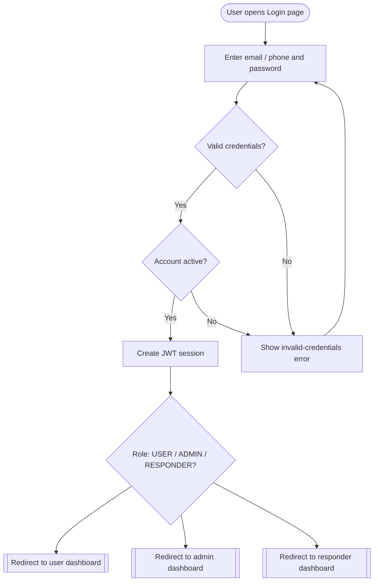

## Flowchart 4.2.2: Registration
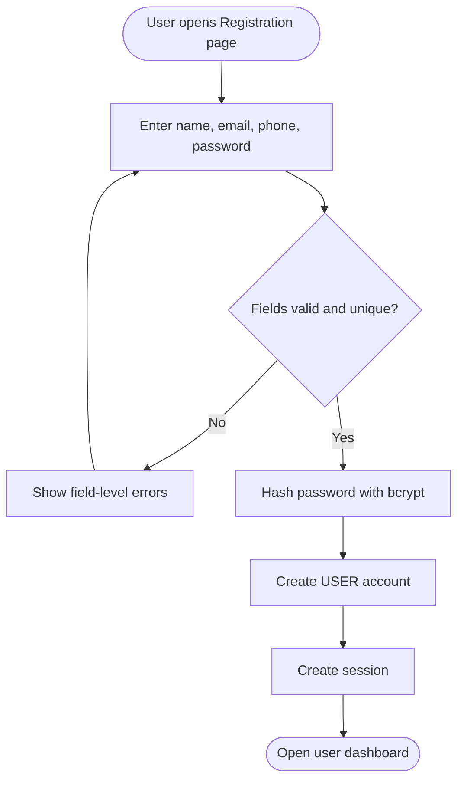

## Flowchart 4.2.3: User Dashboard
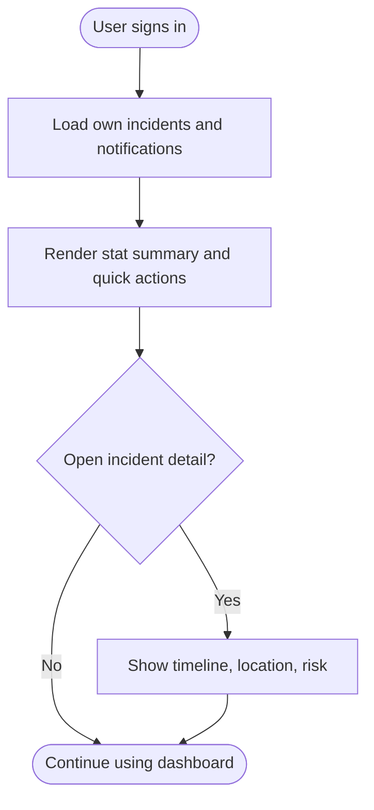

## Flowchart 4.2.4: SOS Creation
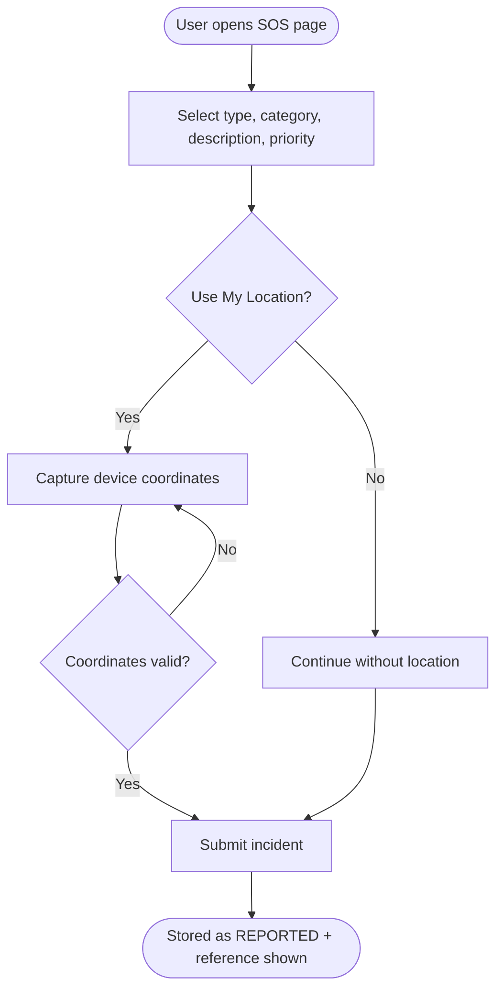

## Flowchart 4.2.5: Incident Detail
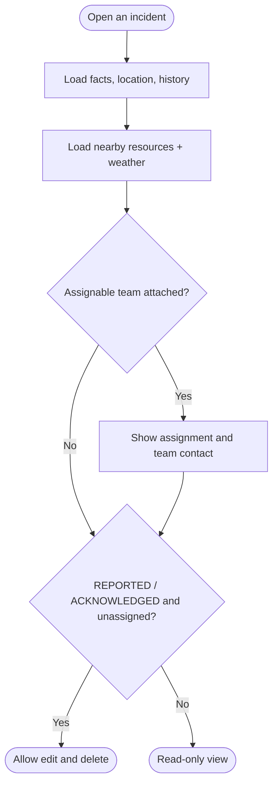

## Flowchart 4.2.6: Emergency Contacts
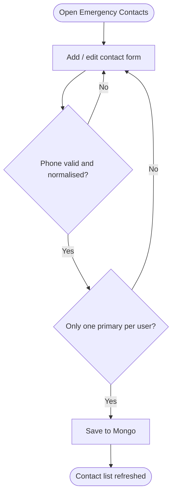

## Flowchart 4.2.7: Resource Lookup
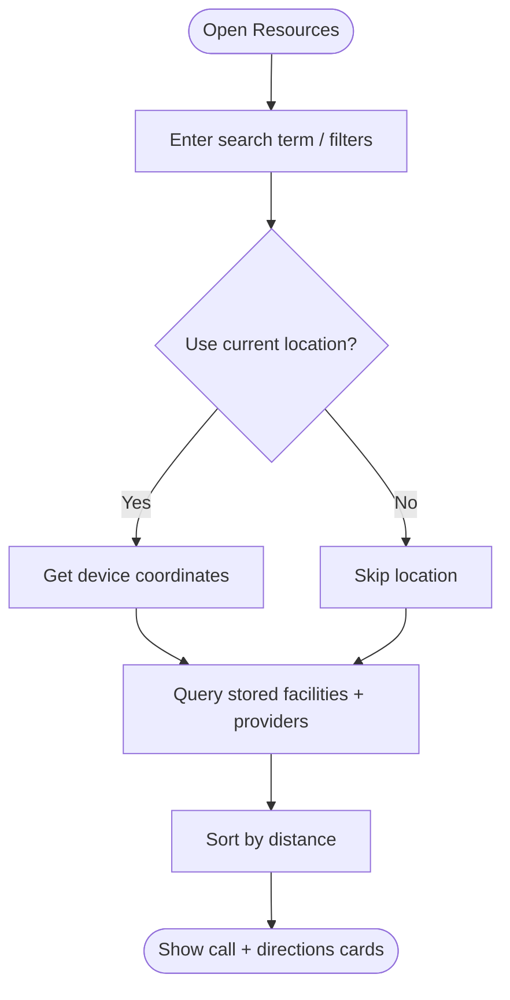

## Flowchart 4.2.8: Unsafe Reporting
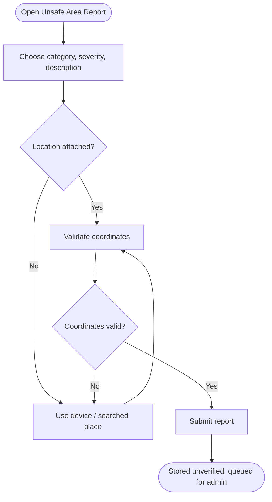

## Flowchart 4.2.9: Risk Assessment
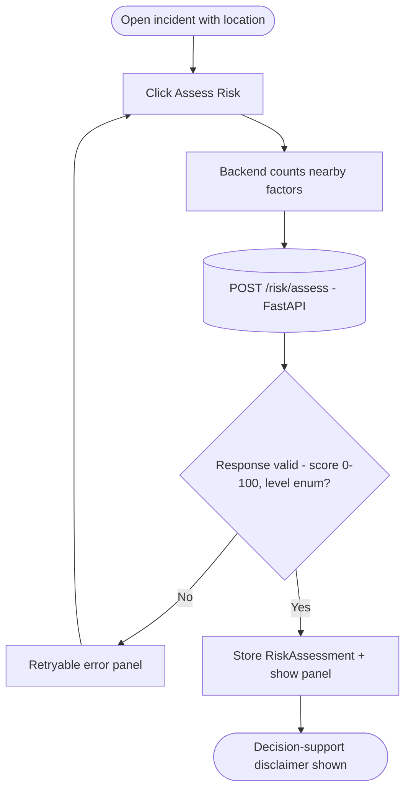

## Flowchart 4.2.10: Notifications
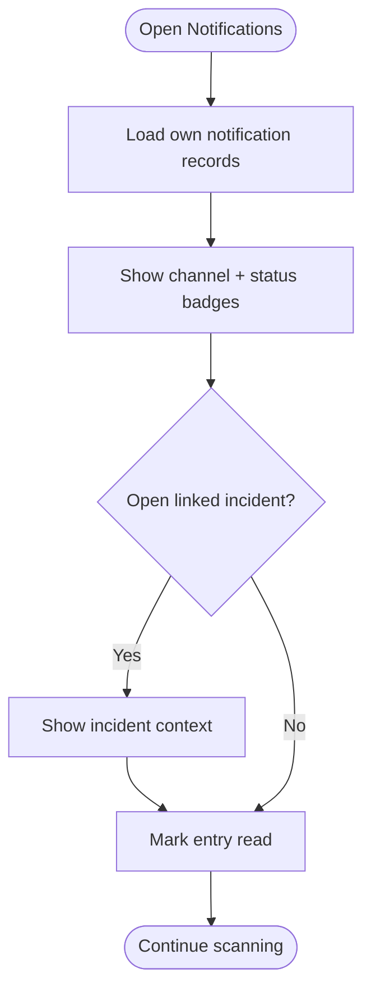

## Flowchart 4.2.11: Profile
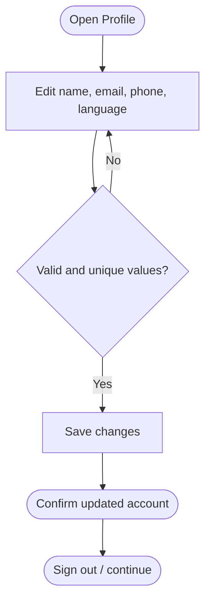

## Flowchart 4.2.12: Admin Dashboard
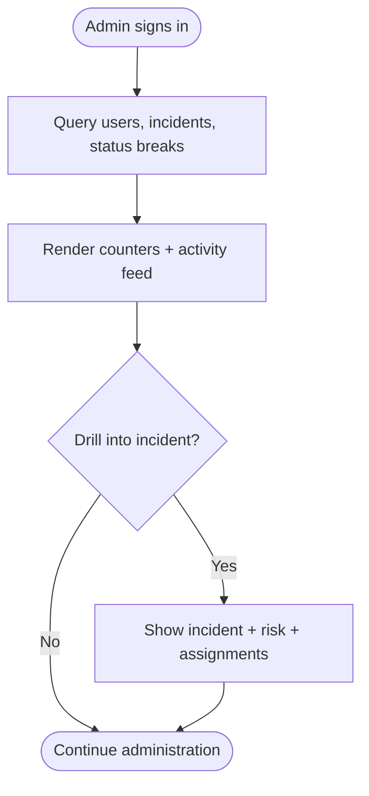

## Flowchart 4.2.13: Admin Incidents
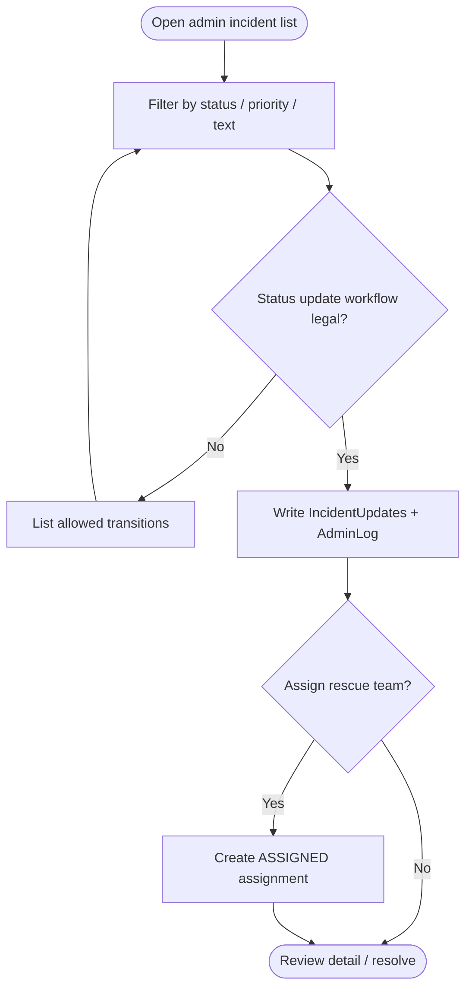

## Flowchart 4.2.14: Admin Masters
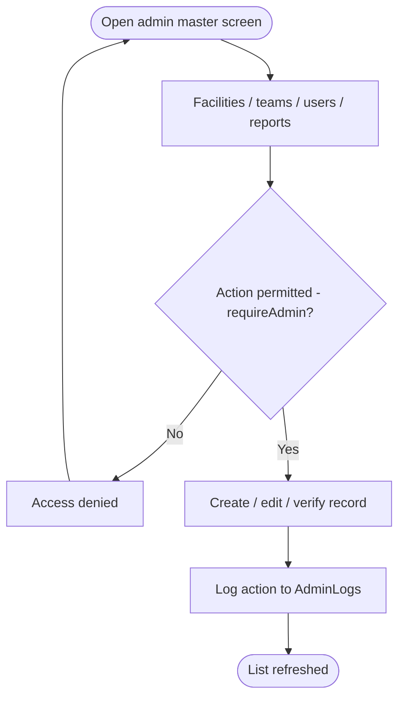

## Figure 4.1: RakshaSafe System Architecture
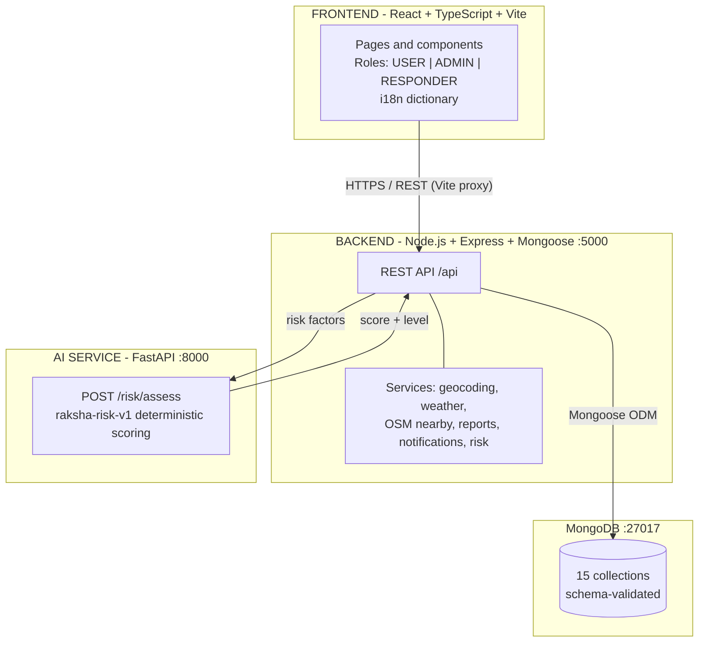

## Figure 4.3: RakshaSafe Deployment View
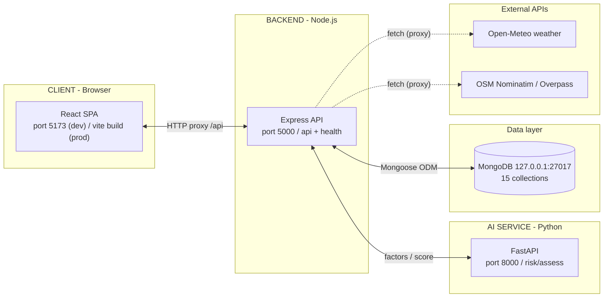
